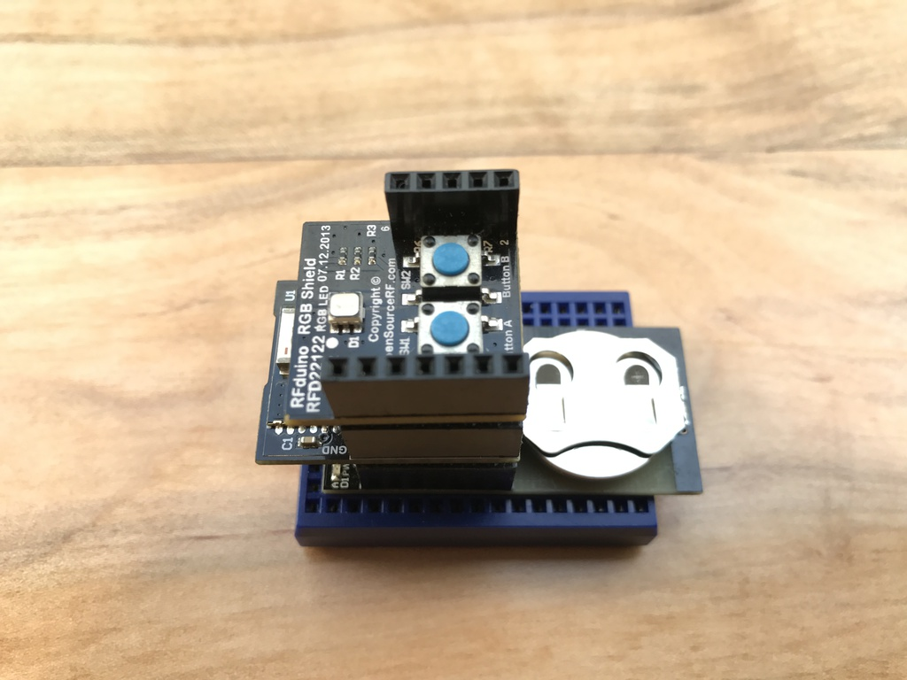
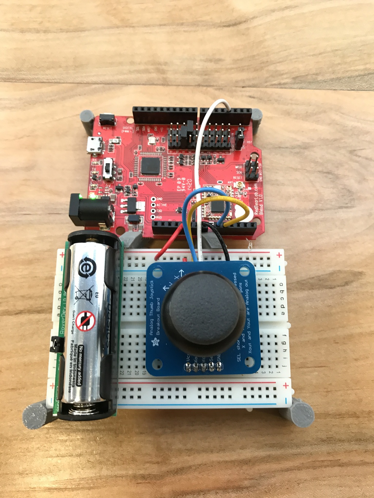
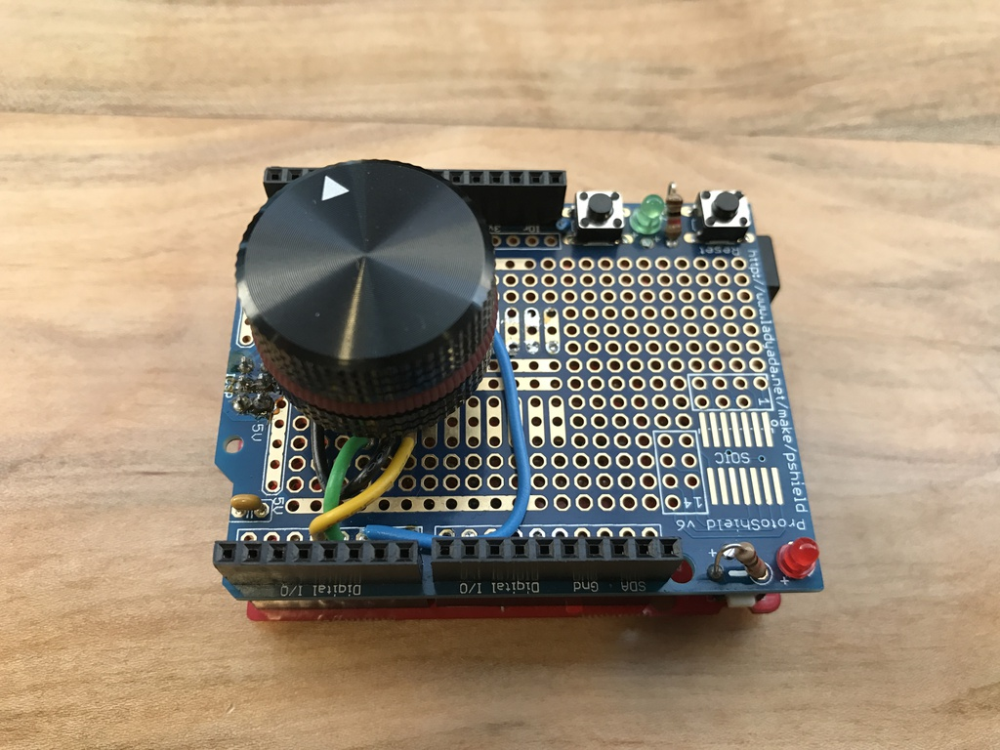

# Bluetooth low energy Human Interface Device (HID)

## Keyboard

[HID_keyboard.ino](HID_keyboard/HID_keyboard.ino)

## Mouse

[HID_joystick_mouse.ino](HID_joystick_mouse/HID_joystick_mouse.ino)

## Multimedia

[HID_volume.ino](HID_volume/HID_volume.ino)

