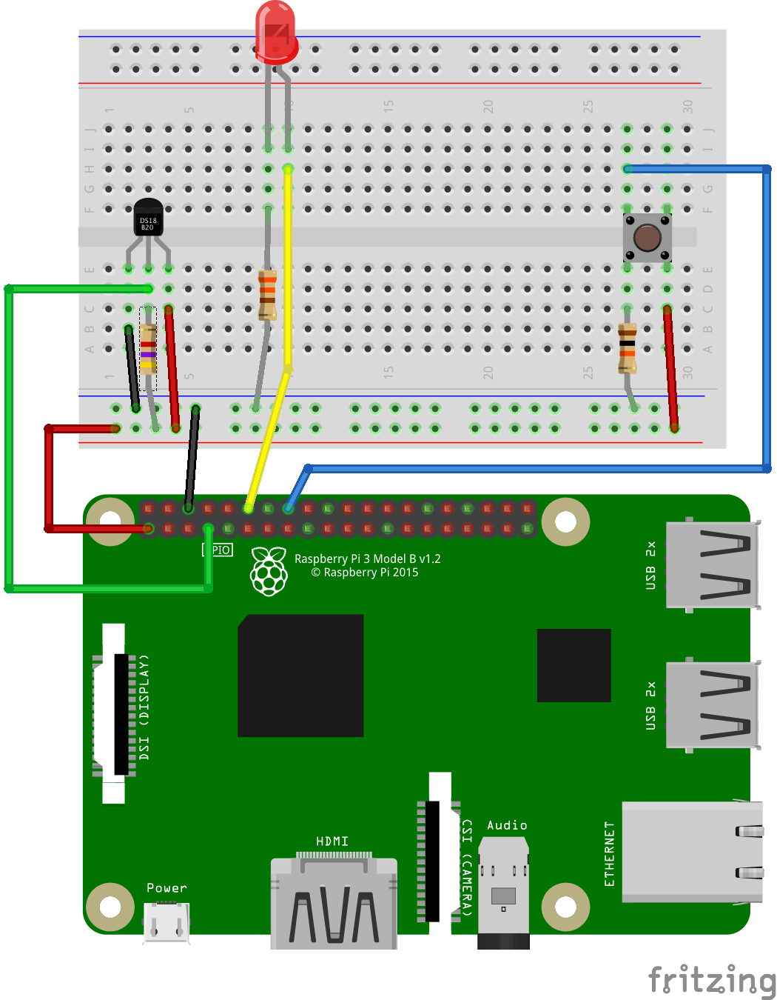

# Bluetooth Peripherals with Node.js and [bleno](https://github.com/noble/bleno)

These examples are intended to be run on a Raspberry Pi 3 or Raspberry Pi Zero Wireless.

## Wiring

## Code

Use the code in [hardware-check](./hardware-check) to ensure the wiring is correct. The [button](./hardware-check/button.js) example should light the LED when the button is pressed. The [temperature](./hardware-check/temperature.js) example reads the current temperature from the [DS18B20](https://www.adafruit.com/product/374). Note that you need to use `raspi-config` to enable the one-wire interface for the temperature sensor.

The code in the [raspberrypi](./raspberrypi) includes the familiar [led](./raspberrypi/led.js), [button](./raspberrypi/button.js), and [thermometer](./raspberrypi/thermometer.js) examples we have created on other plaforms. The [onoff](https://www.npmjs.com/package/onoff) package this is used for GPIO does not support PWM, so the led service only includes the FF11 switch characteristic.

The code in the [johnny-five](./johnny-five) directory re-implements [led](./johnny-five/led.js) and [button](./johnny-five/button.js) examples using [Johnny-Five](http://johnny-five.io/). Johnny-Five adds PWM support so we can add the FF12 dimmer characteristic to LED. Johnny-Five does not support the DS18B20 temperature sensor on the Raspberry Pi. You need to be patient, `npm install` on a Raspberry Pi Zero Wireless can take as long as 5 minutes.

The code in the [combined](./combined) directory has one peripheral providing the LED, button, and thermometer services. Each service is implemented in a separate modules. The main file [index.js](./combined/index.js) requires the service modules. Note that bleno allows us to advertise multiple service UUIDs so the peripheral advertises FF10, FFE0, and BBB0. It does not need to use the combined UUID 721b like the Arduino examples.

The code in the [computer](./computer) directory can be run on your computer. The [button](./computer/button.js)  program uses the `Z` key as a button. The [led](./computer/led.js) program emulates an LED and prints the status to the screen, rather than controlling a real light.
